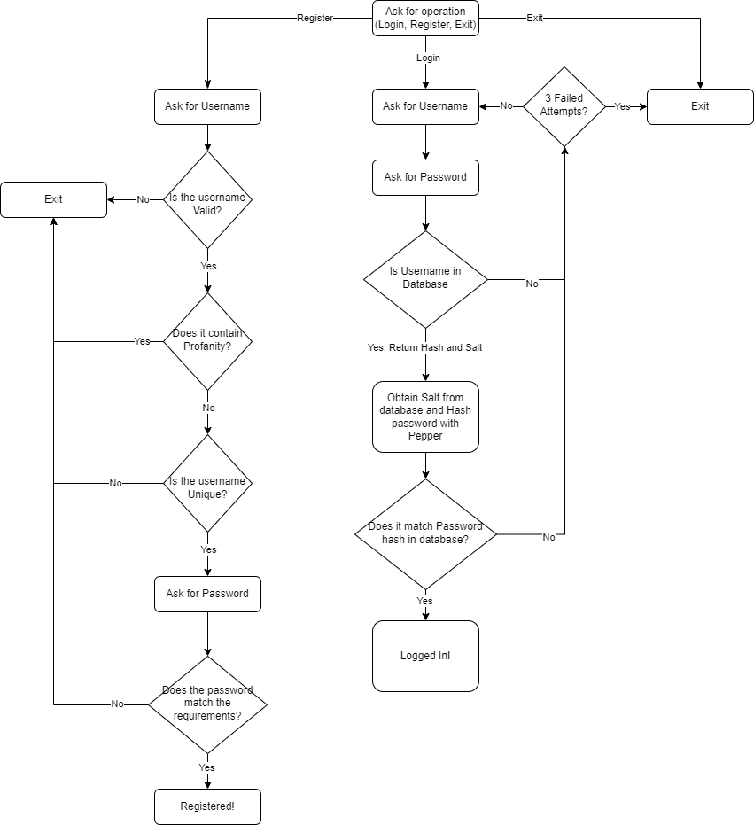

# Assgnment 1

## Diagram

# Instructions
The program is a python program.
You will need to create a virtual environment and installed the requirements.txt file. Then launch the `login.py` file with `python3 ./login.py`.

## Username requirements
The requirements for the username is as follows:
- Only contains letter, number and '_' the underscore character.
- Does not contain profanity
- Is unique

### Enforcement
The character set of the username was checked by performing a REGEX match with using `^[a-zA-Z0-9_]+$`.

To check if the username contained profanity I used a package called better_profanity. The package compares the text against a list of profanity and will return if the string contains profanity at any point. The package also checks for LEET copies of words.

To check if a user name is unique, a database query is made to see if any accounts already exist.

## Password Requirements
The requirements for the password is as follows:
- It must be between 8 and 64 characters long
- It must only container ASCII characters
- It cannot contain the username
- It cannot contain more than 3 repeated or sequential characters
- It cannot be listed in the weak password list
- It cannot be listed in the breacked password list

### Enforcement
The length requirements are simply checked by checking the length of the inputted string. The ACSII requirement is checked by passing the string through the `str.isascii()` Python method.

The username is searched for in the password as a substring, using the `if username in password:` syntax in Python.

The check for too many repeated characters was checked by performing a REGEX match with using `([[:ascii:]])\1{3,}`. This matches any substring of more than 3 repeated characters
The sequential character check was done by iterating through the string and checking that the ASCII code of each 3 character was not in order.

The weak and breached password check was done by comparing the password with each line the in both the breached password file and weack password file.

At each stage of checking the requirements, if the password failed the requirements the registration was halted and the user was notified of the reason the password was rejected, reprompted with the requirements and asked to input a new password.

## Message Notification
### Login (Verification)
When a user attempts to login to the application there are only 2 error messages that can be displayed. First is the login failure due to an incorrect username or password: "Login FAILED. Incorrect Username or Password". This message does not changed if they input a username that is not associated with an account as to not disclose that this user has an account in the system. 

The second is shown if there is an error accessing the database: "There was an error accessing the database." This indicates that there is an internal error with the application's database access and there is nothing the user can currently do except try again.

When logging in the user has 3 attempts at logging into an account. If they fail the 3 attemptes the application will close after displaying: "Too many failed login attempts. Exiting...".

If the user sucessfully logs into their account, a message containing their username will appear to show that they are logged in, like: "Successfully logged in as {their username}".

### Register
When a user attempts to register a new user, if any errors are encounted based on the users input (invalid username or password), they are notified of the specific reason that their input was invalid. For example, if the password contained too many sequential characters this message would be display: "!! That password contains too many sequential character (like '1234' or '4321')". After the error message the user will be shown the requirements again and be reprompted for the username or password.
